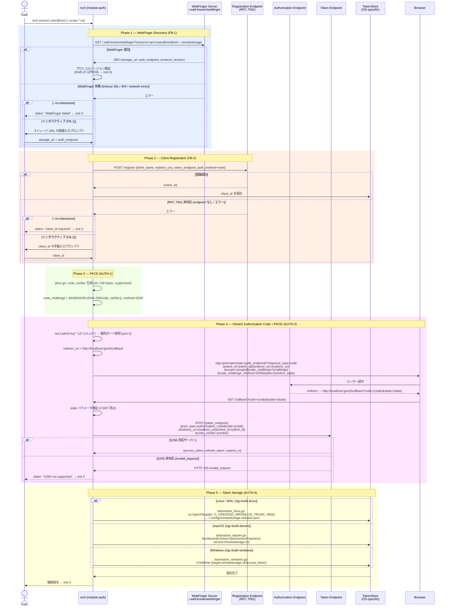
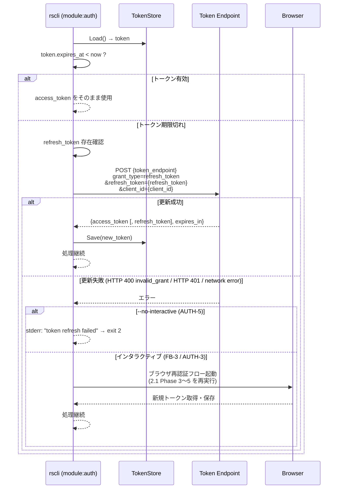

---
codd:
  node_id: design:auth-sequence
  type: design
  depends_on:
  - id: design:auth-design
    relation: depends_on
    semantic: technical
  depended_by:
  - id: plan:implementation-plan
    relation: depends_on
    semantic: technical
  conventions:
  - targets:
    - module:auth
    reason: WebFinger→OAuth2 Authorization Code+PKCE→トークン保存の全フロー網羅必須。フォールバック(WebFinger失敗時の直接URL入力、RFC
      7591非対応時の手動client_id入力、refresh token失敗時のブラウザ再認証)を含む。
  modules:
  - auth
---

# 認証シーケンス図

## 1. Overview

本文書は `module:auth` が担う認証フロー全体のシーケンスを定義する。対象フローは WebFinger（RFC 7033）によるサーバー自動検出、OAuth2 Authorization Code + PKCE（RFC 7636）によるトークン取得、OS 別セキュアストレージへのトークン保存、refresh token 自動更新、および各ステップのフォールバック経路を網羅する。

フォールバック経路は以下の 3 件を明示的に規定する。

| # | フォールバック契機 | インタラクティブ時の動作 | `--no-interactive` 時の動作 |
|---|---|---|---|
| FB-1 | WebFinger リクエスト失敗（ネットワークエラー / タイムアウト 30 秒 / 404） | ストレージ URL の直接入力プロンプトを表示 | 終了コード 3 で終了 |
| FB-2 | RFC 7591 動的クライアント登録エンドポイント非対応 | `client_id` の手動入力プロンプトを表示 | 終了コード 2 で終了 |
| FB-3 | refresh token 更新失敗（HTTP 400 `invalid_grant` / HTTP 401 / ネットワークエラー） | ブラウザ再認証フローを自動起動 | 終了コード 2 で終了 |

すべてのシーケンスは release-blocking 制約 AUTH-1〜AUTH-5 に完全準拠する。いずれかの制約が実装上欠如した場合はリリース不可とする。

---

## 2. Mermaid Diagrams

### 2.1 初回接続フロー（WebFinger → OAuth2 PKCE → トークン保存）



初回接続フローは 5 フェーズで構成される。Phase 1（WebFinger）の所有者は `auth/webfinger.go` であり、フォールバック FB-1 の分岐ロジックも同ファイルが担う。Phase 3 の PKCE 生成は `auth/pkce.go` が単独で所有し、他モジュールからは `pkce.GeneratePair()` を通じてのみ呼び出す。Phase 5 のトークン保存は `TokenStore` インターフェース経由でOS別実装に委譲される。

---

### 2.2 refresh token 自動更新フロー（AUTH-3）



refresh フローの所有者は `auth/refresh.go` であり、リトライ上限到達後に失敗とみなす。フォールバック FB-3（ブラウザ再認証起動）は `auth/oauth2.go` の認可フロー関数を直接呼び出す形で実装する。`--no-interactive` フラグの判定は `module:config` が保持するセッションコンテキストを通じて `auth` モジュールへ伝達する。

---

### 2.3 非インタラクティブモードでの認証判定フロー（AUTH-5）

```mermaid
flowchart TD
    A[rscli コマンド実行<br/>--no-interactive] --> B{TokenStore.Load()}
    B -->|ロード失敗 / トークン不在| C[exit 2<br/>stderr: no valid token found]
    B -->|トークン存在| D{expires_at < now?}
    D -->|有効| E[access_token 使用して処理継続]
    D -->|期限切れ| F{refresh_token 更新試行}
    F -->|成功| G[新 access_token で処理継続]
    F -->|失敗| H[exit 2<br/>stderr: token refresh failed]

    style C fill:#ffcccc
    style H fill:#ffcccc
    style E fill:#ccffcc
    style G fill:#ccffcc
```

非インタラクティブ判定ロジックは `auth/oauth2.go` の認証エントリポイント冒頭で評価する。フォールバック分岐（FB-1、FB-2、FB-3）はいずれも `--no-interactive` が真の場合は到達前に終了コード 2 または 3 で処理を打ち切る。

---

## 3. Ownership Boundaries

### 3.1 モジュール別所有権

| ファイル | 所有フロー | 公開インターフェース | 再実装禁止事項 |
|---|---|---|---|
| `auth/webfinger.go` | Phase 1 全体 + FB-1 フォールバック分岐 | `Discover(userAtHost string) (*ServerInfo, error)` | WebFinger JRD パース・バージョン検証を他ファイルで実装しない |
| `auth/pkce.go` | Phase 3 全体（AUTH-1） | `GeneratePair() (*PKCEPair, error)` | code_challenge 計算・S256 固定を他ファイルで実装しない |
| `auth/oauth2.go` | Phase 4 全体 + state 検証 | `Authorize(ctx, serverInfo, clientID, scope) (*Token, error)` | localhost サーバー起動・state 検証・code 交換を他ファイルで実装しない |
| `auth/registration.go` | Phase 2 全体 + FB-2 フォールバック分岐 | `Register(ctx, regEndpoint string) (clientID string, err error)` | RFC 7591 登録リクエスト組み立てを他ファイルで実装しない |
| `auth/refresh.go` | refresh token 自動更新 + FB-3 フォールバック起動 | `Refresh(ctx, token *Token) (*Token, error)` | refresh 失敗判定・フォールバック起動を他ファイルで実装しない |
| `auth/tokenstore.go` | `TokenStore` インターフェース定義 | `TokenStore` interface | インターフェース定義の複製・再宣言を禁止 |
| `auth/tokenstore_linux.go` | Linux / WSL トークン保存（AUTH-4） | `TokenStore` 実装 | 0600 パーミッション強制を省略・緩和しない |
| `auth/tokenstore_darwin.go` | macOS Keychain 保存（AUTH-4） | `TokenStore` 実装 | SecItemAdd 以外の方式（ファイル保存等）に差し替えない |
| `auth/tokenstore_windows.go` | Windows Credential Manager 保存（AUTH-4） | `TokenStore` 実装 | CredWrite 以外の方式に差し替えない |

### 3.2 モジュール間依存境界

`module:auth` は `module:config` が提供する以下の 2 値にのみ依存し、それ以上の設定読み取りを行わない。

- `config.TokenPath() string` — Linux/WSL 向け `token.json` の絶対パス（`os.UserConfigDir()` + `remotestorage-cli/token.json`）
- `config.IsNonInteractive() bool` — `--no-interactive` フラグの現在値

`module:remotestorage` の HTTP クライアントは HTTPS 強制を共通検証として実施する。`module:auth` 内の HTTP リクエスト（WebFinger、トークンエンドポイント）はこの共通クライアントを経由することで、HTTPS 強制が個別実装に依存しない設計とする。

---

## 4. Implementation Implications

### 4.1 AUTH-1: PKCE S256 固定

`auth/pkce.go` の `GeneratePair()` は `crypto/rand` を使用して 32 バイトのランダムバイト列を生成し、Base64URL エンコード後を `code_verifier` とする（43〜128 文字範囲に収まることを検証）。`code_challenge` は `sha256.Sum256([]byte(verifier))` の結果を `base64.RawURLEncoding.EncodeToString()` で変換する。`code_challenge_method` は定数 `"S256"` を使用し、設定・フラグによる変更は不可能な構造とする。plain フォールバック用のコードパスは一切実装しない。

### 4.2 AUTH-2: localhost 動的ポート割当

`auth/oauth2.go` の `Authorize()` は `net.Listen("tcp", "127.0.0.1:0")` でリスナーを起動し、`listener.Addr().(*net.TCPAddr).Port` で実際のポート番号を取得する。この番号を `redirect_uri` および認可リクエストに埋め込む。ポート番号をハードコードする実装・設定ファイルによるポート固定はリリース不可。

### 4.3 AUTH-3: refresh 失敗時のブラウザ再認証

`auth/refresh.go` の失敗判定条件（HTTP 400 `invalid_grant`、HTTP 401、リトライ上限到達後のネットワークエラー）が成立した場合、インタラクティブモードでは `auth/oauth2.go` の `Authorize()` を再実行する。リトライ回数の上限は 3 回（指数バックオフ）とし、以降を「失敗」とみなす。

### 4.4 AUTH-4: Linux トークンパーミッション強制

`auth/tokenstore_linux.go` の `Save()` は以下の順序でパーミッションを保証する。

1. `os.OpenFile(path, os.O_CREATE|os.O_WRONLY|os.O_TRUNC, 0600)` でファイル作成
2. `Load()` 実行前に既存ファイルのパーミッションを `os.Stat()` で取得し、`mode & 0177 != 0`（0600 より緩い）場合は `os.Chmod(path, 0600)` を実行
3. `os.Chmod` 失敗時は終了コード 4 で終了し stderr に理由を出力

### 4.5 AUTH-5: 非インタラクティブ早期終了

`auth/oauth2.go` の認証エントリポイントは `config.IsNonInteractive()` が真の場合、FB-1 / FB-2 / FB-3 フォールバック分岐に到達するよりも前に所定の終了コードで処理を打ち切る。すべてのエラーメッセージは stderr へ出力し、stdout は汚染しない。

### 4.6 state パラメータ CSRF 防止

`auth/oauth2.go` は認可リクエスト生成時に `crypto/rand` で 16 バイトの `state` 値を生成する。localhost コールバックサーバーが受信した `state` クエリパラメータを、送信時の値とバイト単位で比較（`subtle.ConstantTimeCompare`）する。不一致の場合はコールバックを拒否してエラー終了（終了コード 2）する。

### 4.7 タイムアウト・通信仕様

| リクエスト種別 | 接続タイムアウト | アイドルタイムアウト | スキーム制約 |
|---|---|---|---|
| WebFinger GET | 30 秒 | 60 秒 | HTTPS のみ |
| RFC 7591 登録 POST | 30 秒 | 60 秒 | HTTPS のみ |
| トークンエンドポイント POST | 30 秒 | 60 秒 | HTTPS のみ |
| refresh token POST | 30 秒 | 60 秒 | HTTPS のみ |

### 4.8 既存トークン上書き制御

`rscli connect` 実行時に `TokenStore.Load()` が既存の有効なトークンを返した場合、`--yes` フラグが指定されていない限り上書き確認プロンプトを表示する。`--no-interactive` かつ `--yes` なしの場合は確認なしに上書きを禁止し、終了コード 2 で終了する。

---

## 5. Open Questions

| # | 問い | 背景 | 判断時期 |
|---|---|---|---|
| OQ-SEQ-1 | WebFinger フォールバック（FB-1）で直接入力された URL のバリデーション範囲 | 入力値が HTTPS スキームでない場合 / malformed URL の場合の拒否条件を明確化する必要がある。HTTP を拒否するのみか、ホスト名解決まで検証するかで UX が変わる | WebFinger フォールバック UI 実装開始前 |
| OQ-SEQ-2 | localhost コールバックサーバーの待機タイムアウト | ユーザーがブラウザで認可を完了せずに放置した場合に CLI が無期限待機する問題。待機上限（例: 5 分）を設けてタイムアウト時に終了コード 2 で終了する設計が必要か | OAuth2 フロー実装時 |
| OQ-SEQ-3 | refresh token 有効期限フィールド（`refresh_token_expires_in`）の保存と事前切れ検出 | トークンエンドポイントが `refresh_token_expires_in` を返却するサーバーが存在する。現設計では refresh 試行後に失敗を検知する後手対応のみ。事前に切れを検出してブラウザ再認証を促す仕組みが UX を改善する可能性がある（OQ-AUTH-6 と対応） | 主要 remoteStorage サーバー（php-remote-storage / armadietto）の仕様確認後 |
| OQ-SEQ-4 | 複数アカウント対応時の `TokenStore` インターフェース拡張 | 現 `TokenStore` インターフェースはアカウントキーを引数に持たない。複数アカウント対応時は `Save(token *Token, key string) error` 相当のシグネチャ変更またはファクトリパターンへの移行が必要（OQ-AUTH-4 と対応） | 複数アカウント要件確定後 |
| OQ-SEQ-5 | Linux デスクトップ環境における GNOME Keyring / KDE Wallet 統合時のフロー分岐 | D-Bus 経由のキーリング統合を採用する場合、Linux 向けのシーケンスに「キーリング利用可能か判定」分岐が加わる。フォールバック（ヘッドレス / WSL 向け 0600 ファイル）との切り替え条件をシーケンス図に反映する必要がある（OQ-AUTH-3 と対応） | デスクトップ Linux ユーザーフィードバック確認後 |
