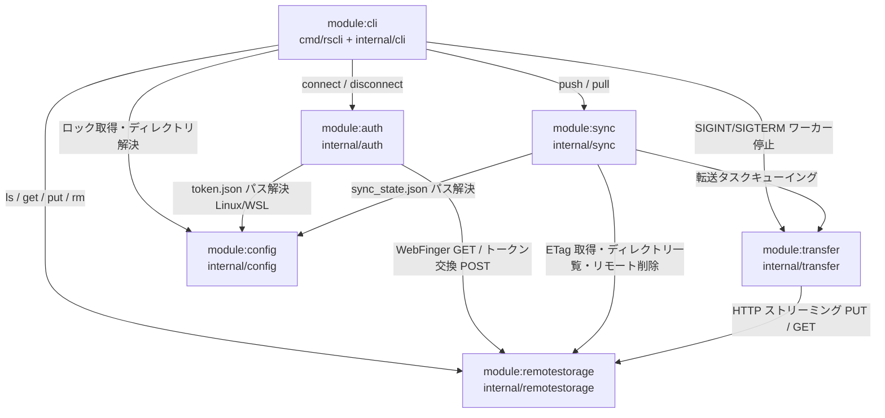
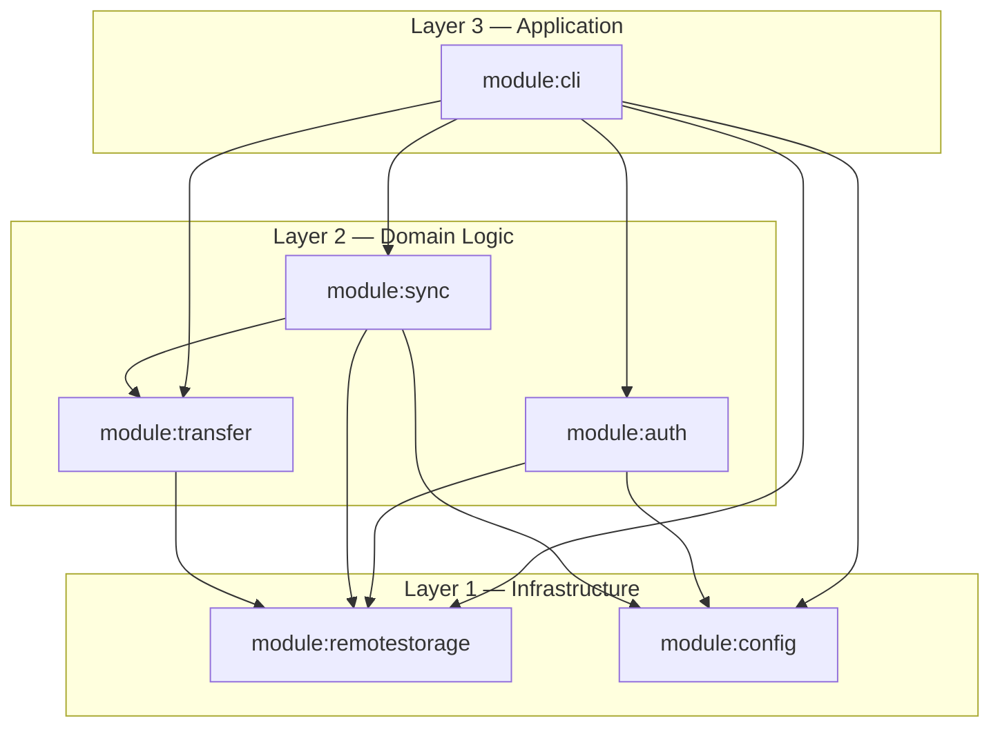

---
codd:
  node_id: design:component-dependency-map
  type: design
  depends_on:
  - id: design:auth-design
    relation: depends_on
    semantic: technical
  - id: design:sync-transfer-design
    relation: depends_on
    semantic: technical
  - id: design:cli-design
    relation: depends_on
    semantic: technical
  depended_by:
  - id: plan:implementation-plan
    relation: depends_on
    semantic: technical
  conventions:
  - targets:
    - module:auth
    - module:sync
    - module:transfer
    - module:remotestorage
    - module:config
    - module:cli
    reason: モジュール間の依存方向はこのマップで定義した方向のみ許容。循環依存はビルド不可のためリリース不可。
  modules:
  - auth
  - sync
  - transfer
  - cli
  - config
  - remotestorage
---

# コンポーネント依存関係マップ

## 1. Overview

本設計書は `rscli` を構成する 6 モジュール（`module:auth`、`module:sync`、`module:transfer`、`module:remotestorage`、`module:config`、`module:cli`）間の依存方向を確定するコンポーネント依存関係マップである。

**リリースブロッキング制約**: 本ドキュメントで定義した方向以外のモジュール間依存（逆方向 import を含む）は一切許容しない。Go コンパイラは循環インポートをビルドエラーとして扱うため、循環依存は自動的にリリースをブロックする。CI の `go build ./...` がグリーンであることは循環依存がないことの必要条件だが十分条件ではなく、意図せぬ依存方向の逆転はコードレビュー段階で拒否しなければならない。本マップで定義した依存グラフへの準拠がリリース判断の前提条件となる。

### 対象モジュールと配置パス

| モジュール | ソースパス | 主責務 |
|---|---|---|
| `module:cli` | `cmd/rscli/` + `internal/cli/` | コマンド定義・終了コード制御・SIGINT/SIGTERM ハンドラ・ロックファイル取得 |
| `module:auth` | `internal/auth/` | WebFinger 発見・OAuth2 + PKCE・OS 別セキュアストレージ・refresh トークンライフサイクル |
| `module:sync` | `internal/sync/` | 変更検出・初回 sync ルール・削除伝播・`sync_state.json` atomic write |
| `module:transfer` | `internal/transfer/` | ストリーミング転送・並列ワーカープール・429 全ワーカー一時停止・プログレス表示 |
| `module:remotestorage` | `internal/remotestorage/` | HTTPS 強制 HTTP クライアント・ETag 操作・ディレクトリ一覧・パスエンコード |
| `module:config` | `internal/config/` | `os.UserConfigDir()` 設定ディレクトリ解決・ロックファイル OS 別実装 |

---

## 2. Mermaid Diagrams

### 2.1 モジュール依存グラフ

このグラフが本プロジェクトにおける**唯一の許容依存方向**を定義する。矢印は「import する側 → import される側」を示す。矢印の逆方向の import はコードレビューで即座に拒否し、CI が循環依存を検出した時点でビルドをブロックする。

`module:remotestorage` と `module:config` は他の内部モジュールを一切 import しないリーフノードである。この性質がアーキテクチャ全体の安定性の基盤となる。`module:sync` → `module:transfer` は同一レイヤー内での依存として唯一許容する。

### 2.2 レイヤードアーキテクチャ図

レイヤー規則: 上位レイヤーから下位レイヤーへの依存のみ許容する。同一レイヤー内の依存は `module:sync` → `module:transfer` の 1 件のみを例外として許容し、それ以外の同層間依存（例: `module:auth` → `module:sync`、`module:auth` → `module:transfer`）は禁止する。下位レイヤーから上位レイヤーへの import は循環依存または責務汚染を招くため、発見次第リリースブロッキング扱いとして即時修正を要求する。

---

## 3. Ownership Boundaries

### module:cli（Layer 3 — Application）

**所有**:
- サブコマンド定義（`connect` / `disconnect` / `ls` / `get` / `put` / `rm` / `push` / `pull`）と引数・フラグパース
- 終了コード定数（`cli/exit.go`）と全コマンドハンドラへの一元適用。コード 0 / 1 / 2 / 3 / 4 の決定はマッピング関数経由のみとし、`os.Exit()` への数値リテラル直接渡しは禁止
- `--dry-run` 有効化制御: `push.go` / `pull.go` / `rm.go` のハンドラのみがフラグ値を参照する。`connect` / `disconnect` / `ls` / `get` / `put` のハンドラはフラグ値を参照しない（RB-2 準拠）
- SIGINT / SIGTERM ハンドラ（`cli/signal.go`）による `module:transfer` ワーカープールへの停止シグナル送信と `module:sync` の `WriteState()` 呼び出し
- `push` / `pull` 実行時のロックファイル取得・解放（`module:config` の lock API を呼び出す）

**所有しない**:
- HTTP 通信の実装（`module:remotestorage` が唯一の所有者）
- トークンの保存・更新ロジック（`module:auth` が唯一の所有者）
- ファイル変更検出・削除伝播（`module:sync` が唯一の所有者）
- ストリーミング転送・429 制御・プログレス出力（`module:transfer` が唯一の所有者）

### module:auth（Layer 2 — Domain Logic）

**所有**:
- WebFinger 発見（RFC 7033）: `auth/webfinger.go`
- PKCE 生成（RFC 7636、S256 固定・plain フォールバックなし）: `auth/pkce.go`
- OAuth2 Authorization Code フロー（localhost ポート 0 動的割当・state CSRF 検証）: `auth/oauth2.go`
- RFC 7591 動的クライアント登録: `auth/registration.go`
- `TokenStore` インターフェースの唯一の定義（`Save` / `Load` / `Delete`）: `auth/tokenstore.go`
- OS 別トークン保護実装（Linux 0600 ファイル / macOS Keychain Services API / Windows Credential Manager API）: `auth/tokenstore_linux.go`、`auth/tokenstore_darwin.go`、`auth/tokenstore_windows.go`
- refresh token 自動更新・ブラウザ再認証フォールバック: `auth/refresh.go`
- `--no-interactive` 時の認証禁止制御（終了コード 2 で終了）

**所有しない**:
- HTTP クライアントの構築と HTTPS 強制検証（`module:remotestorage` の `client.go` を使用）
- 設定ディレクトリパス解決（`module:config` の `os.UserConfigDir()` ラッパーを使用）
- ファイル同期・転送ロジック（`module:sync` / `module:transfer` の管轄）

**`TokenStore` インターフェースの唯一の所有者**: `auth/tokenstore.go` のみで定義する。他モジュールが同等インターフェースを独自に再定義することは再実装ドリフトを招くため禁止する。OS 別実装ファイルはそれぞれ `var _ TokenStore = (*<Impl>)(nil)` 型アサーションでコンパイル時適合を保証する。

### module:sync（Layer 2 — Domain Logic）

**所有**:
- 初回 sync ルール（`sync_state.json` 未存在時に `isFirstSync = true` フラグを立て、push: ローカルのみ→アップロード・リモートのみ→スキップ、pull: リモートのみ→ダウンロード・ローカルのみ→スキップを強制）: `sync/engine.go`
- 変更検出（ETag 優先・`Last-Modified` フォールバック・mtime によるローカル変更検出）: `sync/engine.go`
- `sync_state.json` 読み書き（atomic write・ファイル毎更新・スキーマ管理）: `sync/state.go`
- コンフリクト検出・デフォルトスキップ通知・`--force` 上書き: `sync/conflict.go`
- 削除伝播・`--no-delete` ガード・初回 sync 保護（`isFirstSync = true` 時は `delete.go` がノーオペレーションを返す）: `sync/delete.go`
- `.rsignore` / `--exclude` パターンマッチ（`.gitignore` 互換）: `sync/ignore.go`

**所有しない**:
- 実際の HTTP 転送（`module:transfer` に委譲）
- HTTP クライアントの HTTPS 強制検証（`module:remotestorage` に委譲）
- `sync_state.json` の配置パス計算（`module:config` の `dir.go` に委譲）

### module:transfer（Layer 2 — Domain Logic）

**所有**:
- ストリーミング転送（`os.Open` の `io.Reader` をリクエストボディに直接渡す / レスポンスボディを `io.Copy` でファイルに書き出す・メモリ非ロード・ファイルサイズ上限なし）: `transfer/stream.go`
- ゴルーチンベースのワーカープール（デフォルト 3 並列・`--parallel N` で変更）: `transfer/parallel.go`
- 429 全ワーカー一時停止制御（`globalPauseRequest` チャネルによる一斉停止・`Retry-After` 秒待機後の一斉再開）: `transfer/parallel.go`
- exponential backoff リトライ（対象: 429 / 500 / 502 / 503 のみ・最大 3 回・初回待機 1 秒・最大 30 秒・フルジッター・`Retry-After` 値と算出 backoff 値の大きい方を採用）: `transfer/retry.go`
- プログレス表示（`N/M files` 形式・stderr 固定・`golang.org/x/term.IsTerminal` による非 TTY 自動抑制）: `transfer/progress.go`
- Content-Type 自動検出（`mime.TypeByExtension`・不明拡張子は `application/octet-stream`・`--content-type` 上書き）: `transfer/contenttype.go`

**所有しない**:
- 変更検出・削除伝播（`module:sync` の管轄）
- HTTP クライアントの構築と HTTPS 強制（`module:remotestorage` に委譲）

**プログレス表示の唯一の所有者**: `transfer/progress.go` が出力ロジックを一元管理する。`module:cli` 側が直接 stderr にプログレスを書くことは禁止し、必ず `module:transfer` の API を経由する。

### module:remotestorage（Layer 1 — Infrastructure）

**所有**:
- HTTPS 強制 HTTP クライアント（全リクエスト送信前に URL スキームを検証・`http://` の場合はリクエストを拒否）: `remotestorage/client.go`
- タイムアウト設定（接続 30 秒・アイドル 60 秒）
- ETag 生成・`If-None-Match` / `If-Match` ヘッダ処理: `remotestorage/etag.go`
- ディレクトリ一覧取得（`application/ld+json`）: `remotestorage/directory.go`
- リモートパスの URL エンコーディング（`/` 区切り固定、ローカル `filepath` 区切りとの変換）: `remotestorage/path.go`

**所有しない**:
- 認証トークンの付与ロジック（呼び出し側が `access_token` をヘッダに付与する）
- リトライロジック（並列転送の 429 全ワーカー一時停止は `module:transfer` が所有）

**HTTP クライアントの唯一の所有者**: HTTPS 強制検証は `remotestorage/client.go` のみで実装する。`module:auth` / `module:sync` / `module:transfer` が独自の HTTP クライアントを構築することは禁止する。`--insecure` フラグは TLS 証明書検証スキップのみを制御し、HTTP（非暗号化）通信は `--insecure` 指定時も拒否する。

### module:config（Layer 1 — Infrastructure）

**所有**:
- `os.UserConfigDir()` による OS 別設定ディレクトリ解決と `remotestorage-cli/` サブディレクトリ作成（Linux: `~/.config/remotestorage-cli/`、macOS: `~/Library/Application Support/remotestorage-cli/`、Windows: `%AppData%\remotestorage-cli\`）: `config/dir.go`
- ロックファイル管理（`O_CREATE | O_EXCL` 排他作成・PID 記録・stale 自動削除）: `config/lock.go`
- OS 別プロセス存在確認（Unix: シグナル 0 送信 / Windows: `OpenProcess` API）: `config/lock_unix.go`（`//go:build !windows`）、`config/lock_windows.go`（`//go:build windows`）

**所有しない**:
- 設定ファイルの内容解釈（`sync_state.json` パースは `module:sync`・`token.json` パースは `module:auth`）
- ロックファイルの取得タイミング制御（`module:cli` が `push` / `pull` 前に呼び出す）

**設定パス解決の唯一の所有者**: `os.UserConfigDir()` の呼び出しと `remotestorage-cli/` サブディレクトリのパス構築は `config/dir.go` のみで行う。各モジュールがパスをハードコードすることは禁止する。

---

## 4. Implementation Implications

### 4.1 循環依存禁止の具体的制約

本マップで許容する import パスを以下の表に示す。表に存在しない組み合わせは実装・PR レビュー時点で即座に拒否しマージを禁止する。この表への準拠がリリース判断の前提条件となる。

| import する側 | import される側 | 用途 |
|---|---|---|
| `module:cli` | `module:auth` | `connect` / `disconnect` コマンド実装 |
| `module:cli` | `module:sync` | `push` / `pull` コマンド実装 |
| `module:cli` | `module:transfer` | SIGINT / SIGTERM ハンドラによるワーカープール停止 |
| `module:cli` | `module:remotestorage` | `ls` / `get` / `put` / `rm` コマンド実装 |
| `module:cli` | `module:config` | ロックファイル取得・設定ディレクトリ解決 |
| `module:auth` | `module:remotestorage` | WebFinger GET・トークンエンドポイント POST |
| `module:auth` | `module:config` | `token.json` パス解決（Linux / WSL） |
| `module:sync` | `module:transfer` | ファイル転送タスクのキューイング |
| `module:sync` | `module:remotestorage` | ETag 取得・ディレクトリ一覧・リモートファイル削除 |
| `module:sync` | `module:config` | `sync_state.json` 配置パス解決 |
| `module:transfer` | `module:remotestorage` | HTTP ストリーミング PUT / GET |

**禁止例**（非網羅的・発見次第リリースブロック）:

| 禁止 import | 違反理由 |
|---|---|
| `module:remotestorage` → `module:auth` | 逆方向 / 循環 |
| `module:config` → 任意の内部モジュール | リーフノード違反 |
| `module:auth` → `module:sync` | 同層間禁止依存 |
| `module:transfer` → `module:sync` | 逆方向 |
| `module:transfer` → `module:config` | 許容外の直接依存 |

### 4.2 ビルドタグと OS 別実装

OS 別実装はビルドタグで切り替える。ビルドタグの追加・変更は本設計書の更新と同時に行う。

| ファイル | ビルドタグ | 実装内容 |
|---|---|---|
| `auth/tokenstore_linux.go` | `//go:build linux` | ファイルパーミッション 0600（`os.OpenFile` で作成・既存ファイルは `os.Chmod` で修正・修正失敗は終了コード 4） |
| `auth/tokenstore_darwin.go` | `//go:build darwin` | macOS Keychain Services API（`SecItemAdd` / `SecItemCopyMatching` / `SecItemDelete`） |
| `auth/tokenstore_windows.go` | `//go:build windows` | Windows Credential Manager API（`CredWrite` / `CredRead` / `CredDelete`） |
| `config/lock_unix.go` | `//go:build !windows` | シグナル 0 送信によるプロセス存在確認 |
| `config/lock_windows.go` | `//go:build windows` | `OpenProcess` API によるプロセス存在確認 |

`TokenStore` インターフェース（`auth/tokenstore.go`）は全 OS 共通のコントラクトであり、ビルドタグなしで常にコンパイルされる。OS 別実装ファイルはそれぞれ `var _ TokenStore = (*<Impl>)(nil)` 型アサーションを記述し、コンパイル時にインターフェース適合を保証する。

### 4.3 HTTPS 強制の単一実装ポイント

`remotestorage/client.go` が全 HTTP リクエストの URL スキーム検証を担う唯一の実装ポイントである。この検証は `module:auth`（WebFinger GET / OAuth2 POST）・`module:sync`（ETag 取得 / ディレクトリ一覧）・`module:transfer`（ストリーミング PUT / GET）・`module:cli`（`ls` / `get` / `put` / `rm`）のすべてに対して透過的に適用される。各モジュールが独自の HTTPS 検証を追加することで重複・矛盾が生じることを防ぐため、HTTPS 検証ロジックは `remotestorage/client.go` のみに配置する。`--insecure` フラグは TLS 証明書検証スキップのみを制御し、HTTP 通信はこのフラグが指定された場合も拒否する。

### 4.4 sync_state.json atomic write と SIGINT 連携

`sync/state.go` の `WriteState()` が atomic write の唯一の実装ポイントである。実装手順: 同一ディレクトリに `sync_state.json.tmp.{pid}` を作成・fsync 後、`os.Rename` でアトミックに置換する。`cli/signal.go` は SIGINT / SIGTERM 受信時に `module:transfer` のワーカープールを停止させた後、`module:sync` の `WriteState()` を呼び出して完了済みファイルのエントリのみを記録する。未完了ファイルのエントリは記録しないことで、次回 `push` / `pull` 時に中断箇所からの再開を保証する。`WriteState()` を呼び出す箇所は `sync/state.go` の API を必ず経由し、`sync_state.json` への直接書き込みは他ファイルから禁止する。

### 4.5 429 全ワーカー一時停止の単一制御点

`transfer/parallel.go` の `globalPauseRequest` チャネルが 429 受信時の全ワーカー一時停止制御の唯一の実装ポイントである。いずれかのワーカーが HTTP 429 を受信した場合、そのワーカーが `globalPauseRequest` に `Retry-After` 秒数を送信し、スーパーバイザーが全ワーカーへ一斉停止シグナルをブロードキャストする。`Retry-After` ヘッダが存在しない場合は `transfer/retry.go` の exponential backoff 値（`random(0, min(30, 1 * 2^attempt))`）を使用し、両者が存在する場合は大きい方を採用する。`module:sync` は個別ワーカーに停止を指示せず、必ず `module:transfer` のスーパーバイザーを経由する。`ls` / `get` / `put` / `rm` の単発リクエストはワーカープールを通過しないため、この全ワーカー一時停止機構は `push` / `pull` 経由の並列転送にのみ適用される。

### 4.6 終了コードの一元管理

`cli/exit.go` が終了コード 0 / 1 / 2 / 3 / 4 の定数とエラーマッピング関数の唯一の所有者である。コマンドハンドラはエラーオブジェクトを `exit.go` のマッピング関数に渡して終了コードを取得し、`os.Exit()` に数値リテラルを直接渡すことは禁止する。`module:auth`・`module:sync`・`module:transfer` がエラーを返す際はエラー種別を識別可能なカスタムエラー型（例: `auth.ErrNoToken`、`auth.ErrRefreshFailed`、`transfer.ErrRateLimitExhausted`）を使用し、終了コードへの変換は `cli/exit.go` のマッピングテーブルで行う。部分的失敗（コード 1）は 1 ファイルでもリトライ上限到達で失敗した時点でコード 1 を確定し、コード 0 にフォールバックすることはリリース不可とする。

### 4.7 プログレス表示の出力先強制

`transfer/progress.go` がプログレス出力ロジックを一元管理し、出力先を `os.Stderr` に固定する。`module:cli` 側が直接 `os.Stderr` にプログレスを書くことは禁止し、必ず `module:transfer` の API を経由する。非 TTY 判定は `golang.org/x/term.IsTerminal(int(os.Stderr.Fd()))` で行い、非 TTY 時はプログレス出力を自動抑制する。`--no-interactive` 指定時も非 TTY と同様に抑制する。警告・エラーメッセージは非 TTY 時も stderr に出力する（抑制対象外）。`--verbose` フラグ指定時は転送中ファイルパスを 1 行ずつ stderr に出力するが、この出力は TTY 判定によらず常に行う。

### 4.8 シンボリックリンク・特殊ファイルのスキャン

`push` / `put` 実行前のローカルファイルスキャンでは `os.Lstat` を使用し、`os.Stat` によるシンボリックリンク解決を行わない。`os.ModeSymlink` または特殊ファイルモード（デバイスファイル・名前付きパイプ・ソケット）を検出した時点でスキップし、`WARNING: skipping symlink: {path}` または `WARNING: skipping special file: {path}` を stderr に出力する。スキャンはスキップ後も継続し、warning 対象ファイルのみがスキップされ他が全成功の場合は終了コード 0 を返す。これはシンボリックリンクチェーンを利用したパストラバーサル攻撃を防止するセキュリティ要件であり、`os.Stat` 使用への変更はセキュリティリスクとしてリリースブロッキング扱いとする。

### 4.9 プラットフォームカバレッジとリリースゲート

GitHub Actions のビルドマトリクスが以下の 5 バイナリすべてのビルド成功を確認する。いずれか 1 つでもビルドが失敗した場合はリリースをブロックする。

| バイナリ名 | GOOS | GOARCH |
|---|---|---|
| `rscli-linux-amd64` | linux | amd64 |
| `rscli-linux-arm64` | linux | arm64 |
| `rscli-darwin-amd64` | darwin | amd64 |
| `rscli-darwin-arm64` | darwin | arm64 |
| `rscli-windows-amd64.exe` | windows | amd64 |

OS 別ビルドタグを持つファイルは対応する `GOOS` でのみコンパイルされることを CI のクロスコンパイルで確認する。WSL 環境は Linux 扱いとして `//go:build linux` の実装が適用される。

---

## 5. Open Questions

| # | 問い | 背景 | 判断時期 |
|---|---|---|---|
| OQ-CDM-1 | `module:cli` から `module:transfer` への直接依存（SIGINT / SIGTERM ハンドラ用）を維持するか、`module:sync` を経由した間接停止に変更するか | 現設計では `cli/signal.go` が `module:transfer` のワーカープールに直接停止シグナルを送るため `module:cli` → `module:transfer` の直接 import が発生する。これを `module:sync` 経由に変更すると依存エッジを 1 件削減できるが、`module:sync` の責務がシグナル処理まで拡大する | シグナルハンドラ実装着手前 |
| OQ-CDM-2 | `module:auth` が `module:remotestorage` の HTTP クライアントを直接使用する形を維持するか、`module:auth` 専用の薄い HTTP クライアントを持つか | 現設計は HTTPS 強制を `remotestorage/client.go` に集約するために `module:auth` → `module:remotestorage` 依存を導入している。WebFinger / OAuth2 の HTTP リクエストは remoteStorage プロトコル操作と性格が異なるため、分離した方が責務が明確になる可能性がある。ただし HTTPS 強制の単一実装ポイント原則と相反する | `module:auth` 実装着手前 |
| OQ-CDM-3 | `ls` / `get` / `put` / `rm` の単発リクエストのリトライ制御をどこに配置するか | 現設計では `push` / `pull` の並列転送は `module:transfer` の 429 全ワーカー一時停止機構を利用するが、`ls` / `get` / `put` / `rm` の単発リクエストはこの機構を通過しない。単発リクエストにも exponential backoff（429 / 500 / 502 / 503・最大 3 回・最大 30 秒）を適用するための実装を `remotestorage/client.go` 内に持つか、`module:transfer` に単発 API を追加するかが未定 | `ls` / `get` / `put` / `rm` コマンド実装着手前 |
| OQ-CDM-4 | 複数アカウント対応時に `module:config` のロックファイルスコープを変更するか | 現設計のロックファイル（`{設定ディレクトリ}/lock`）はプロセス単位で 1 つ。複数アカウントが同時に `push` / `pull` を実行する場合、アカウント別ロックファイル（`lock.{user}@{host}`）が必要になる可能性がある（`auth_design.md` OQ-AUTH-4・`sync_transfer_design.md` OQ-S6 と連動） | 複数アカウント需要がユーザーフィードバックで確認された時点 |
| OQ-CDM-5 | Linux デスクトップ向けキーリング統合（GNOME Keyring / KDE Wallet）を `module:auth` 内に追加した場合の D-Bus 依存が依存グラフに与える影響 | `github.com/zalando/go-keyring` 等を `auth/tokenstore_linux.go` に組み込む場合、Linux ビルドが D-Bus 実行環境に依存するためヘッドレス・WSL 環境でのフォールバックが必要になる。ビルドタグ構成が増加し `module:config` との責務境界も再整理が必要になる（`auth_design.md` OQ-AUTH-3 と連動） | デスクトップ Linux ユーザーからのフィードバックに基づき判断 |
