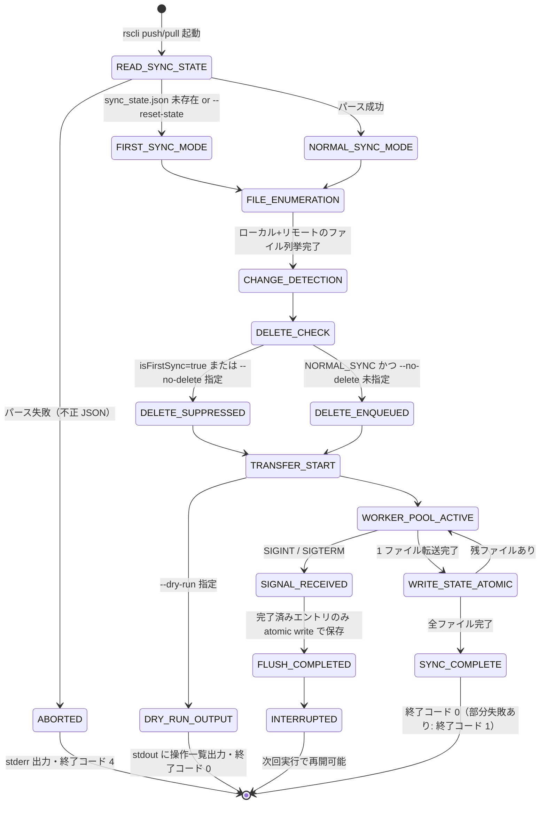
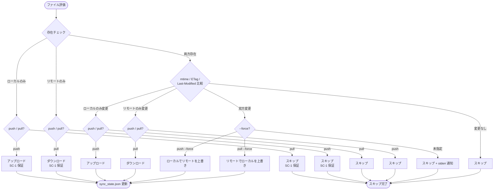
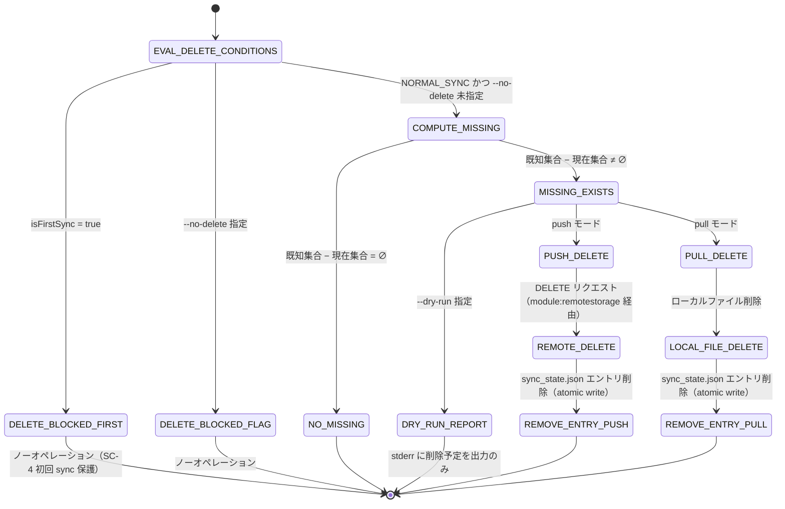
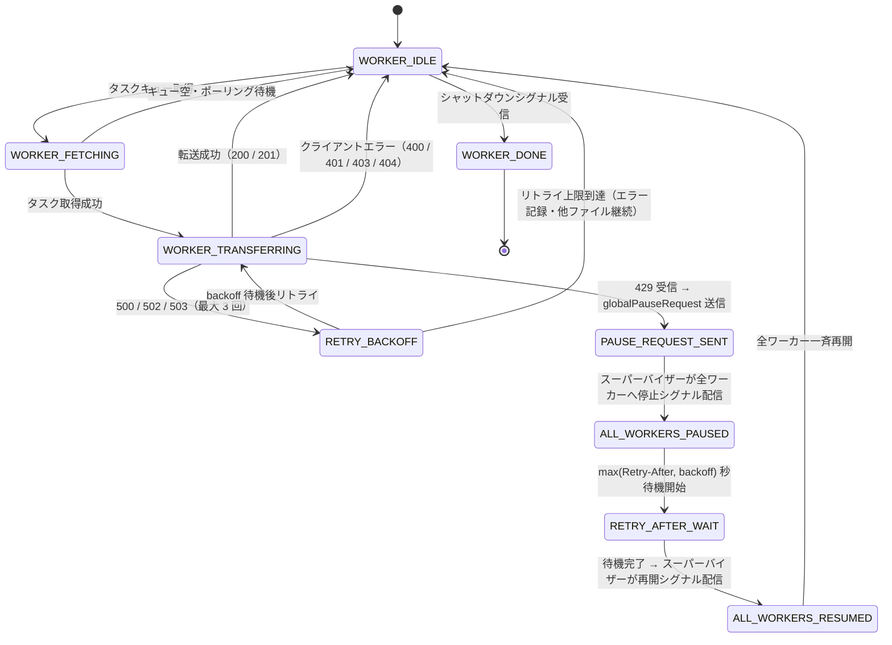

---
codd:
  node_id: design:sync-state-machine
  type: design
  depends_on:
  - id: design:sync-transfer-design
    relation: depends_on
    semantic: technical
  depended_by:
  - id: plan:implementation-plan
    relation: depends_on
    semantic: technical
  conventions:
  - targets:
    - module:sync
    reason: 変更検出(ローカル:mtime、リモート:ETag優先/Last-Modifiedフォールバック)、コンフリクト時スキップ(--forceで上書き)、初回sync挙動、削除伝播、中断再開の全状態遷移を定義必須。
  modules:
  - sync
---

# 同期状態遷移図

## 1. Overview

本設計書は `module:sync` の全状態遷移を定義する。`rscli push` / `rscli pull` の起動から正常終了・異常終了・中断までを包括し、以下の全領域をカバーする。

- **変更検出**: ローカルは mtime、リモートは ETag 優先 / Last-Modified フォールバックによる変更判定
- **初回 sync 挙動（SC-1）**: `sync_state.json` 未存在時のファイル単位ルール
- **コンフリクト処理**: 双方変更時のデフォルトスキップと `--force` 強制上書き
- **削除伝播（SC-4）**: push / pull での削除伝播・`--no-delete` 無効化・初回 sync 保護
- **`sync_state.json` atomic write（SC-2）**: ファイル完了ごとの更新と SIGINT / SIGTERM 受信時の安全な中断
- **並列転送ワーカーと 429 制御（SC-3）**: デフォルト 3 並列・全ワーカー一時停止・Retry-After 適用

対象モジュール:

| モジュール | ソースパス | 主責務 |
|---|---|---|
| `module:sync` | `internal/sync/` | 変更検出・同期ルール・削除伝播・`sync_state.json` 管理 |
| `module:transfer` | `internal/transfer/` | 並列転送ワーカー・429 全停止制御・ストリーミング転送 |

本書が準拠するリリースブロッキング制約:

| ID | 制約概要 | 本書での反映箇所 |
|---|---|---|
| SC-1 | 初回 sync 挙動（push: ローカルのみ→アップロード / リモートのみ→スキップ、pull: リモートのみ→ダウンロード / ローカルのみ→スキップ） | Section 2.1（FIRST_SYNC_MODE 分岐）、Section 2.2 |
| SC-2 | `sync_state.json` は atomic write 必須・ファイル完了ごとに更新・中断後再開可能 | Section 2.1（WRITE_STATE_ATOMIC、FLUSH_COMPLETED）、Section 2.3 |
| SC-3 | 429 受信時は全ワーカー一時停止・Retry-After 値を全ワーカーに適用・デフォルト並列数 3 | Section 2.4 |
| SC-4 | 削除伝播: push 時ローカル削除→リモート削除・pull 時リモート削除→ローカル削除・`--no-delete` で無効化・初回 sync では実行しない | Section 2.1（DELETE_CHECK）、Section 2.3 |

---

## 2. Mermaid Diagrams

### 2.1 同期エンジン — ライフサイクル状態遷移

`READ_SYNC_STATE` から `FIRST_SYNC_MODE` / `NORMAL_SYNC_MODE` / `ABORTED` への分岐は `sync/state.go` の `LoadState()` が担う。`isFirstSync` フラグは `LoadState()` が `(nil, nil)` を返した場合のみ `true` に設定され、それ以外の手段で `false` から `true` に変更することを禁ずる。`FILE_ENUMERATION` から `SYNC_COMPLETE` までのオーケストレーションは `sync/engine.go` が担い、`DELETE_CHECK` の実体は `sync/delete.go` に委譲される。`WRITE_STATE_ATOMIC` は `sync/state.go` の `WriteState()` が担い、tmp ファイル書き込み → `os.Rename` による原子的置換を保証する。`SIGNAL_RECEIVED` は `cli/signal.go` が受信し、`FLUSH_COMPLETED` は `sync/state.go` の `WriteState()` を呼び出す。SC-2 は `WRITE_STATE_ATOMIC` と `FLUSH_COMPLETED` により保証され、全ファイル一括書き込みの実装は許可しない。

---

### 2.2 ファイル単位 — 変更検出・同期ルール決定

`EXIST` チェックおよび `DETECT` は `sync/engine.go` が担う。リモート ETag の取得は `module:remotestorage` 経由で行い、`module:sync` が直接 HTTP を発行しない。`--force` 分岐は `sync/conflict.go` の `ResolveConflict()` が担い、`sync/engine.go` から呼び出す。ETag が空またはヘッダ未存在の場合は `Last-Modified` にフォールバックし、`Last-Modified` も存在しない場合は変更ありとして転送を実行する（保守的動作）。「不明 → スキップ」の実装を禁ずる。

SC-1 は `ローカルのみ / push → アップロード`・`ローカルのみ / pull → スキップ`・`リモートのみ / push → スキップ`・`リモートのみ / pull → ダウンロード` の 4 経路が保証する。初回 sync と 2 回目以降 sync でこの 4 経路は同一であり、`isFirstSync` フラグは `BOTH_EXIST` に対する変更検出ステップを省略するために使用しない（初回 sync でも `sync_state.json` が存在する場合は変更検出を行う）。

---

### 2.3 削除伝播 — 状態遷移

`EVAL_DELETE_CONDITIONS` から `COMPUTE_MISSING` までは `sync/delete.go` が担う。「既知集合」は `sync_state.json` のエントリキー集合であり、`sync/state.go` の `KnownPaths()` が返す。`KnownPaths()` が空集合を返す場合も `COMPUTE_MISSING → NO_MISSING` 遷移となり削除伝播を実行しない（entries フィールドが空の `sync_state.json` による誤削除の防止）。SC-4 の初回 sync 保護は `DELETE_BLOCKED_FIRST` 遷移が担い、`isFirstSync = true` の場合に `sync/delete.go` の `ShouldDelete()` が即座にノーオペレーションを返す早期リターンで実装する。`--dry-run` 時は `[DELETE] {path}` 形式を stderr に出力するが、リモート DELETE リクエストもローカルファイル削除も `sync_state.json` エントリ削除も実行しない。

---

### 2.4 転送ワーカー — 429 全ワーカー一時停止状態遷移

ワーカーのライフサイクルは `transfer/parallel.go` のスーパーバイザーゴルーチンが管理する。デフォルトワーカー数は 3（SC-3 準拠の定数）で `--parallel N` により変更可能。`globalPauseRequest` チャネルはバッファ容量 1 とし、複数ワーカーが同時に 429 を受信した場合でも送信ブロックが発生しないようにする。スーパーバイザーが `globalPauseRequest` を一度受信した後は、次の再開シグナルを発信するまでの間に追加受信した 429 シグナルをドレインし、単一の待機サイクルで全ワーカーを一時停止する。Retry-After 解析と `max(Retry-After, backoff)` 計算は `transfer/retry.go` が担い、`parallel.go` から呼び出す。`Retry-After` ヘッダが存在しない場合は backoff 値のみを使用する（`sleep = random(0, min(30, 1 * 2^attempt))`）。個々のワーカーが独立して 429 を再試行する実装は SC-3 違反であり禁止する。

---

## 3. Ownership Boundaries

### 3.1 ファイル単位の責務マトリクス

| 機能・状態 | 所有ファイル | 呼び出し関係 |
|---|---|---|
| `sync_state.json` 読み込み・`isFirstSync` フラグ設定 | `sync/state.go` (`LoadState()`) | `sync/engine.go` から呼び出し |
| ファイル列挙・変更検出・per-file ルーティング | `sync/engine.go` | `sync/state.go`、`sync/conflict.go`、`sync/delete.go`、`module:remotestorage` を呼び出し |
| コンフリクト検出・`--force` 評価 | `sync/conflict.go` (`ResolveConflict()`) | `sync/engine.go` から呼び出し |
| 削除伝播・初回 sync 保護・`--no-delete` ガード | `sync/delete.go` (`ShouldDelete()`) | `sync/state.go` の `KnownPaths()` を呼び出し、`module:remotestorage` に DELETE を発行 |
| `sync_state.json` atomic write | `sync/state.go` (`WriteState()`) | `sync/engine.go`、`sync/delete.go`、`cli/signal.go` から呼び出し |
| 除外パターン評価（`.rsignore` / `--exclude`） | `sync/ignore.go` | `sync/engine.go` から呼び出し |
| ワーカープール・429 全停止制御・再開 | `transfer/parallel.go` | `transfer/stream.go`、`transfer/retry.go` を呼び出し |
| backoff 計算・Retry-After 解析 | `transfer/retry.go` | `transfer/parallel.go` から呼び出し |
| ストリーミング転送 | `transfer/stream.go` | `module:remotestorage` HTTP クライアントを使用 |
| プログレス表示（`N/M files`・非 TTY 自動抑制） | `transfer/progress.go` | `transfer/parallel.go` から呼び出し |
| SIGINT / SIGTERM ハンドリング | `cli/signal.go` | `transfer/parallel.go`（停止）、`sync/state.go`（flush）を呼び出し |

### 3.2 単一所有の原則（再実装禁止）

以下の機能はプロジェクト内で唯一の実装を持つ。他のファイルによる重複実装はリリースブロッカーとして扱う。

- **`sync/state.go` の `WriteState()`**: `sync_state.json` への書き込みはすべてこの関数を経由する。他のファイルが直接 `os.WriteFile` または `os.Create` で `sync_state.json` を書き込むことを禁ずる。
- **`sync/delete.go` の `ShouldDelete()`**: `isFirstSync` フラグと `--no-delete` フラグの両方を評価する唯一の判定点。`sync/engine.go` がこれらのフラグを独自に参照して削除判定することを禁ずる。
- **`transfer/parallel.go` のスーパーバイザーゴルーチン**: 429 受信時の全ワーカー一時停止・Retry-After 待機・一斉再開ロジックを集約する。個々のワーカーが独立した 429 リトライロジックを持つことを禁ずる。
- **`transfer/retry.go` の backoff 計算**: `Retry-After` ヘッダ解析と `max(Retry-After, backoff)` 計算はここのみで行う。

### 3.3 モジュール間通信の境界規則

`module:sync` から `module:transfer` への通信はバッファ付きチャネル経由の一方向依存とし、`module:transfer` が `module:sync` の内部データ構造（`sync_state.json` 含む）に直接アクセスすることを禁ずる。転送完了通知はコールバック経由で `sync/engine.go` に通知し、`sync/engine.go` が `sync/state.go` の `WriteState()` を呼び出す。

HTTP 通信は `module:remotestorage` の HTTP クライアントを経由する。HTTPS 強制（URL スキーム `https://` の検証）は HTTP クライアント側で実施済みであり、`module:sync` / `module:transfer` が重複して実装しない。`--insecure` フラグは TLS 証明書検証スキップのみを制御し、HTTP（非暗号化）通信を許可しない。

---

## 4. Implementation Implications

### 4.1 SC-1: `isFirstSync` フラグの設定ルール

`isFirstSync` フラグは `sync/state.go` の `LoadState()` が `(nil, nil)` を返した場合のみ `true` に設定する。`LoadState()` がエラーを返した場合は `isFirstSync` を設定せずに終了コード 4 で中断する。`--reset-state` は `sync_state.json` を削除した後に `LoadState()` を呼び出すことで `isFirstSync = true` を自然に導出し、`engine.go` が `--reset-state` を特別ケースとして `isFirstSync` を直接 `true` に設定する実装を禁ずる。初回 / 2 回目以降の両 sync で `ローカルのみ` / `リモートのみ` の 4 経路ルールは同一であり、`isFirstSync` フラグは `BOTH_EXIST` ケースに対してのみ動作を変化させる（初回 sync での `sync_state.json` 前回エントリ不在による変更検出不能の回避）。

### 4.2 SC-2: atomic write の粒度とシグナル対応

`WriteState()` の呼び出し粒度は「1 ファイルの転送完了ごと」とし、全ファイル完了後の一括書き込みは SC-2 違反である。一時ファイルパス `sync_state.json.tmp.{pid}` はプロセス起動時に存在すれば削除する。`SIGINT` が任意のタイミングで到達した場合に完了済みファイルのエントリが `sync_state.json` に保存されていることが再開可能性の前提であり、転送中ファイルの完了を待たない即時停止が要件である。次回 `push/pull` 実行時は `sync_state.json` に記録されていないファイルを変更ありとして再処理することで中断箇所から再開する。

### 4.3 SC-3: globalPauseRequest チャネル設計

`globalPauseRequest` チャネルはバッファ容量 1 とし、複数ワーカーが同時に 429 を受信した場合に送信ブロックが発生しないようにする。スーパーバイザーが一度 `globalPauseRequest` を受信したら、次の再開シグナルを発信するまでの間に追加受信したシグナルをドレインする。Retry-After 計算: `retryAfterSec = max(retryAfterHeader, exponentialBackoff(attempt))` とし、`retryAfterHeader` が 0（ヘッダ未存在）の場合は backoff 値のみを使用する。

### 4.4 SC-4: 削除伝播の安全ガード

`sync/delete.go` の `ShouldDelete()` は `isFirstSync = true` の場合に即座にノーオペレーションを返す早期リターンを実装する。`KnownPaths()` が空集合を返す場合（`sync_state.json` の entries フィールドが空のとき）も削除伝播を実行しない。「前回既知集合が空 = 全ファイルが削除された」と解釈するデータ損失シナリオを防ぐための防衛的実装である。

### 4.5 変更検出のフォールバック動作

リモート ETag が空文字列または `If-None-Match` レスポンスに ETag ヘッダが含まれない場合、`Last-Modified` ヘッダにフォールバックする。`Last-Modified` も存在しない場合は変更ありとして転送を実行する（保守的動作）。「不明 → スキップ」の実装を禁ずる。mtime は `sync_state.json` に Unix エポック秒（整数）で保存し、サブ秒精度は記録しない。

### 4.6 `--dry-run` の境界

`--dry-run` 指定時は実際のファイル転送・削除・`sync_state.json` 更新を行わず、実行予定操作（`[UPLOAD] {path}`・`[DOWNLOAD] {path}`・`[SKIP] {path}`・`[DELETE] {path}` プレフィックス付き）を stdout に出力して終了コード 0 で終了する。プログレス表示は行わない。削除伝播の予定は `[DELETE] {path}` 形式で stderr に出力する。

---

## 5. Open Questions

| # | 問い | 背景 | 判断時期 |
|---|---|---|---|
| OQ-SM-1 | `sync_state.json` スキーマバージョン移行戦略 | `schema_version: 1` を定義済みだが、チェックサムフィールド追加等の構造変更が必要になった場合に `LoadState()` が旧バージョンを読み込んで変換する手順が未定義。バージョン分岐の実装位置（`state.go` 内か専用の migrator か）を決定する必要がある | スキーマ変更を伴う機能追加が計画された時点 |
| OQ-SM-2 | コンフリクト解決のインタラクティブモード | 現在の状態遷移はスキップまたは `--force` 上書きの 2 択。ファイルごとに keep / overwrite / diff を選択するインタラクティブモードを追加する場合、`sync/conflict.go` に `CONFLICT_INTERACTIVE` 状態と stdin 読み取りループが必要になり、並列ワーカーとの同期が複雑化する | ユーザーフィードバックでコンフリクト頻度が報告された時点 |
| OQ-SM-3 | `--parallel N` の上限値と警告閾値 | 上限制約がない場合、高い並列数が 429 を誘発しやすい。上限値（例: 20）と警告閾値（例: 10 以上で stderr 警告）を `FILE_ENUMERATION` 前のバリデーション段階で実装するかどうかが未定 | 実サーバーでの負荷測定後 |
| OQ-SM-4 | `sync_state.json` 大規模エントリ時の I/O ボトルネック | ファイル完了ごとに `WriteState()` が `sync_state.json` 全体を atomic write する設計は、エントリ数 10 万件超で読み書きコストが増大する可能性がある。SQLite 等の組み込み DB に移行する場合、`WriteState()` / `LoadState()` の API シグネチャを維持したまま内部実装を差し替えられる設計にするかどうかを検討する | ベンチマークで JSON 方式のボトルネックが確認された時点 |
| OQ-SM-5 | 複数アカウント対応時の `sync_state.json` ファイル分離 | 現在は `{設定ディレクトリ}/sync_state.json` 単一ファイルを前提とする。複数アカウント対応時は `sync_state.{user}@{host}.json` 形式に分離する必要があり、`LoadState()` / `WriteState()` のパス解決ロジックと全状態遷移の起点 `READ_SYNC_STATE` に影響する | `system_design.md` OQ-3 の複数アカウント判断と同タイミング |
| OQ-SM-6 | `--dry-run --json` 機械可読出力 | 現在の `--dry-run` 出力は人間可読テキスト。CI パイプラインでの利用を想定して `--dry-run --json` を追加する場合、`DRY_RUN_OUTPUT` 状態からの出力経路を分岐する必要がある | CI 連携ユースケースが報告された時点 |
