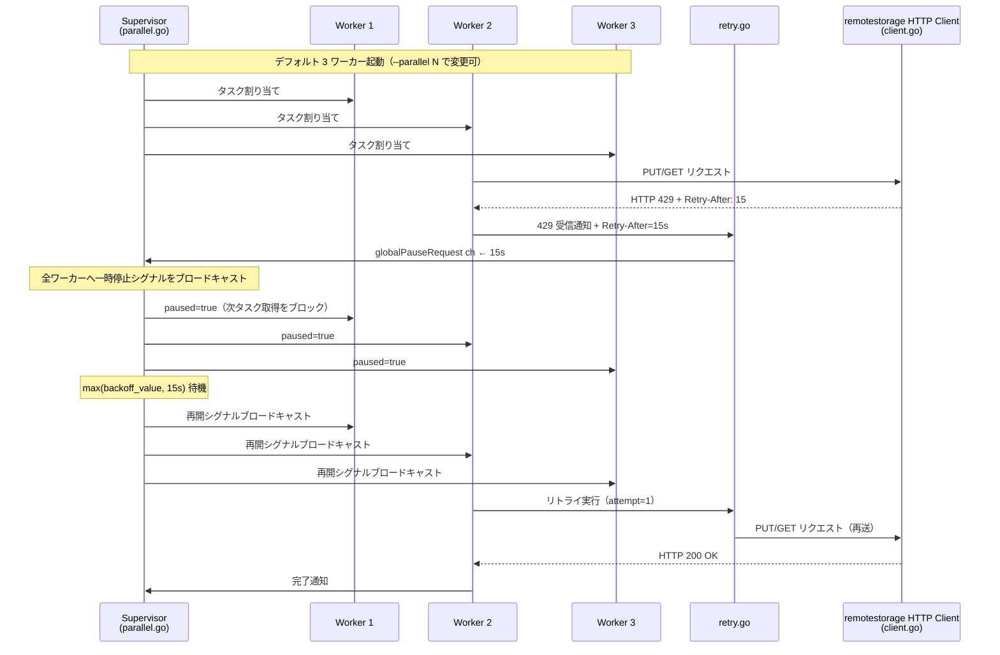
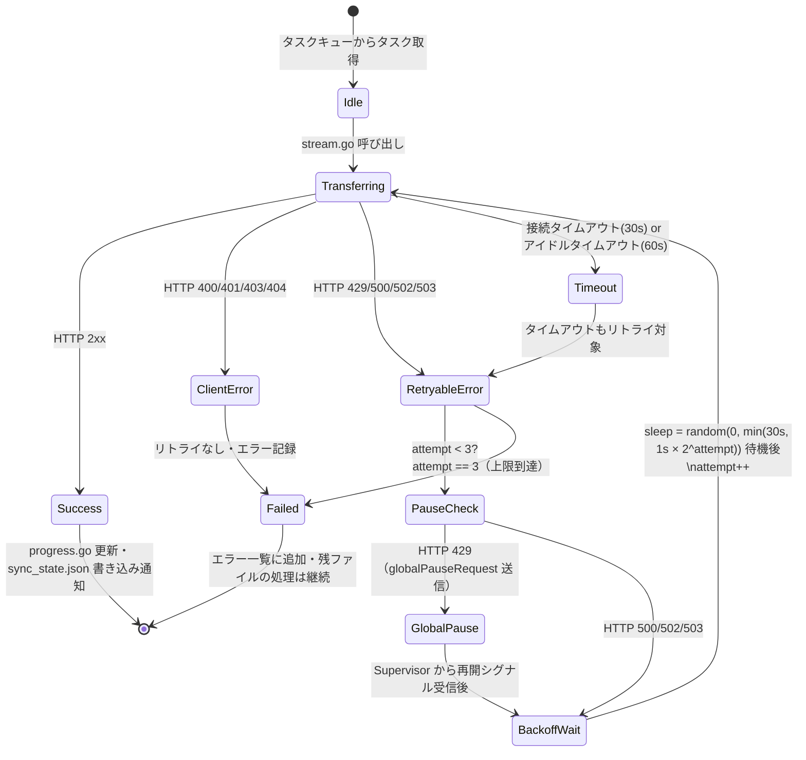
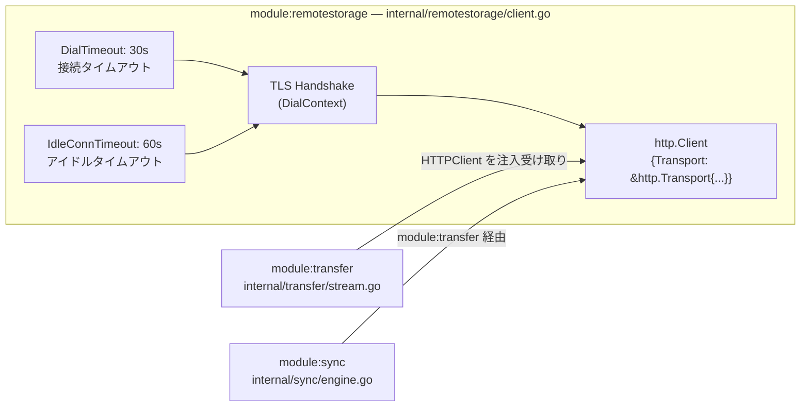
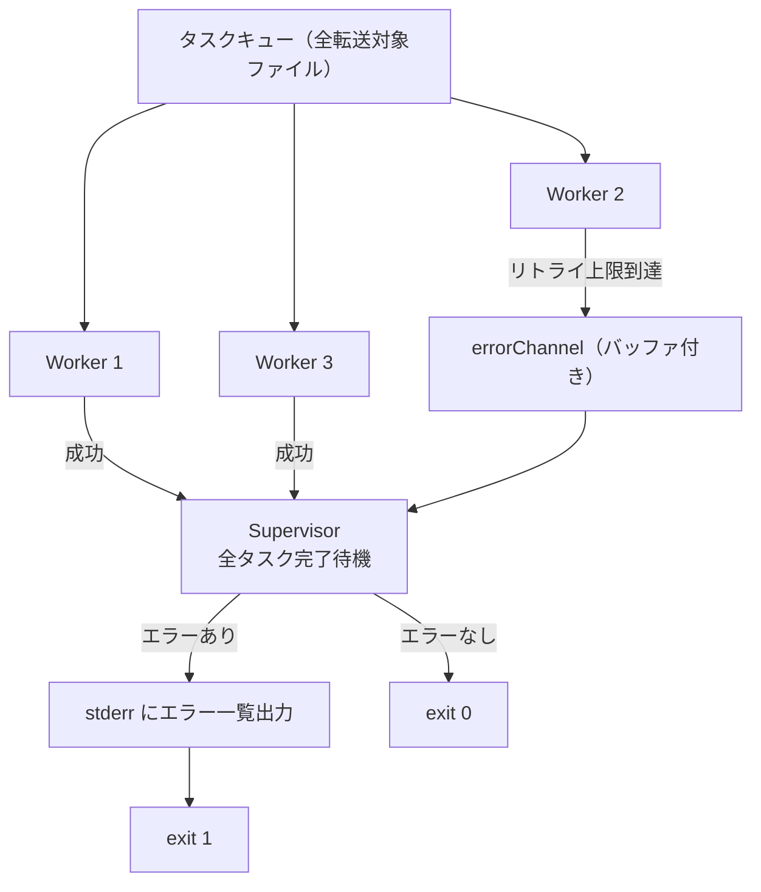

---
codd:
  node_id: design:transfer-retry-flow
  type: design
  depends_on:
  - id: design:sync-transfer-design
    relation: depends_on
    semantic: technical
  depended_by:
  - id: plan:implementation-plan
    relation: depends_on
    semantic: technical
  conventions:
  - targets:
    - module:transfer
    reason: exponential backoff(初回1秒/最大30秒/フルジッター)、429時全ワーカー停止+Retry-After適用、最大3回リトライの実装仕様を図示必須。
  - targets:
    - module:remotestorage
    reason: HTTPタイムアウト(接続30秒/アイドル60秒)はHTTPクライアント設定として実装必須。
  modules:
  - transfer
  - remotestorage
---

# 転送・リトライフロー図

## 1. Overview

本設計書は `module:transfer`（`internal/transfer/`）が実装する並列転送パイプライン、exponential backoff リトライロジック、429 全ワーカー一時停止フロー、および `module:remotestorage` の HTTP クライアントタイムアウト設定を詳細に図示する。

本設計書は以下 2 件のリリースブロッキング制約に完全準拠する。

| # | 対象 | 制約 | 本書での反映箇所 |
|---|---|---|---|
| RC-1 | `module:transfer` | exponential backoff（初回 1 秒 / 最大 30 秒 / フルジッター）、429 時全ワーカー停止 + Retry-After 適用、最大 3 回リトライの実装仕様を図示必須 | Section 2.1, 2.2, Section 4 |
| RC-2 | `module:remotestorage` | HTTP タイムアウト（接続 30 秒 / アイドル 60 秒）は HTTP クライアント設定として実装必須 | Section 2.3, Section 4 |

対象ソースファイルは以下のとおり。

| ファイル | 責務 |
|---|---|
| `internal/transfer/parallel.go` | ワーカープール（デフォルト 3）・グローバル一時停止制御 |
| `internal/transfer/retry.go` | exponential backoff・Retry-After 適用・最大 3 回リトライ |
| `internal/transfer/stream.go` | ストリーミング転送（アップロード / ダウンロード） |
| `internal/transfer/progress.go` | stderr プログレス表示 |
| `internal/remotestorage/client.go` | HTTP クライアント（接続タイムアウト 30 秒 / アイドルタイムアウト 60 秒） |

---

## 2. Mermaid Diagrams

### 2.1 並列転送ワーカーライフサイクルと 429 全ワーカー一時停止フロー



**所有権と制約**: `globalPauseRequest` チャネルの送信権は各ワーカーが持ち、受信・ブロードキャストは `parallel.go` の Supervisor ゴルーチンが単独で所有する。Worker が直接他の Worker に停止シグナルを送ることを禁じ、Supervisor を唯一の制御点とする。`paused` フラグの読み書きは `sync.Cond` または `select` で保護し、データレースを排除する。

---

### 2.2 単一ワーカーのリトライ状態遷移（RC-1 準拠）



**所有権と制約**: 状態遷移ロジックはすべて `retry.go` が所有する。バックオフ計算式は `sleep = random(0, min(30, 1 × 2^attempt))` 秒のフルジッター方式で固定し、別モジュールが独自実装することを禁止する。429 に対して `Retry-After` ヘッダが存在する場合、`backoff_value` と `Retry-After` 値を比較して大きい方を待機時間とする。`ClientError`（4xx、429 を除く）はリトライなしで即時失敗とし、残ファイルの処理は継続する。

---

### 2.3 HTTP クライアントタイムアウト設定（RC-2 準拠）



**所有権と制約**: HTTP クライアントの設定（`DialContext` タイムアウト 30 秒、`IdleConnTimeout` 60 秒）は `module:remotestorage` の `client.go` が唯一の実装箇所とする。`module:transfer` および `module:sync` はタイムアウト値をハードコードせず、`module:remotestorage` が提供する `http.Client` インスタンスを依存注入で受け取る。タイムアウト発生時のエラーは `retry.go` が `RetryableError` として処理し、最大 3 回のリトライ対象とする（RC-1 との連携）。

---

### 2.4 部分失敗時のエラー集約フロー



**所有権と制約**: `errorChannel` の集約は `parallel.go` の Supervisor が担当する。1 ファイルのリトライ上限到達は残ファイルの処理を中断しない。全ファイル処理完了後にエラー一覧を stderr に出力し、終了コード 1 で終了する。`sync_state.json` への書き込みは成功したファイルのエントリのみを対象とし、失敗ファイルは記録しない。

---

## 3. Ownership Boundaries

| 所有モジュール | ファイル | 所有する責務 | 他モジュールへの制約 |
|---|---|---|---|
| `module:transfer` | `parallel.go` | ワーカープール生成・デフォルト数 3・グローバル一時停止ブロードキャスト・`errorChannel` 集約 | `module:sync` はワーカー数を直接操作しない。Supervisor のみが停止/再開シグナルを送信する |
| `module:transfer` | `retry.go` | exponential backoff 計算（フルジッター）・最大 3 回リトライ・`Retry-After` 適用・リトライ対象ステータス判定 | バックオフ計算式を重複実装禁止。`module:sync` はリトライロジックを独自実装しない |
| `module:transfer` | `stream.go` | ストリーミング転送（`io.Reader` → PUT / GET → `io.Writer`）・メモリ非展開 | `module:sync` が直接 HTTP リクエストを発行することを禁止 |
| `module:transfer` | `progress.go` | TTY 判定・`N/M files` 形式 stderr 出力・ファイル完了ごとの更新 | プログレス出力の実装を他モジュールに持つことを禁止 |
| `module:remotestorage` | `client.go` | `http.Client` 設定（接続タイムアウト 30 秒 / アイドルタイムアウト 60 秒）・HTTPS スキーム強制 | タイムアウト値のハードコードを `module:transfer` および `module:sync` に禁止。`--insecure` フラグによる HTTP（非暗号化）通信許可を禁止 |
| `module:sync` | `state.go` | `sync_state.json` の atomic write（一時ファイル → `os.Rename`）・ファイル毎更新 | `module:transfer` は `sync_state.json` を直接書き込まず、コールバックまたはチャネルで `module:sync` に通知する |

---

## 4. Implementation Implications

### 4.1 RC-1: リトライ仕様の実装要件（リリースブロッキング）

`transfer/retry.go` は以下のパラメータをコード定数として宣言し、コメントで RC-1 との対応を明示する。

| 定数名（案） | 値 | 根拠 |
|---|---|---|
| `retryMaxAttempts` | `3` | RC-1: 最大 3 回リトライ |
| `retryBaseSeconds` | `1.0` | RC-1: バックオフ初回 1 秒 |
| `retryMaxSeconds` | `30.0` | RC-1: バックオフ最大 30 秒 |
| `retryableStatuses` | `{429, 500, 502, 503}` | RC-1: リトライ対象ステータス |
| `defaultWorkerCount` | `3` | RC-1: 並列転送デフォルト 3 |

バックオフ計算の参照実装:

```go
// sleep = random(0, min(retryMaxSeconds, retryBaseSeconds * 2^attempt))
cap := math.Min(retryMaxSeconds, retryBaseSeconds*math.Pow(2, float64(attempt)))
sleep := time.Duration(rand.Float64()*cap) * time.Second
```

`Retry-After` ヘッダが存在する場合:

```go
retryAfter := parseRetryAfter(resp.Header.Get("Retry-After"))
sleep = max(sleep, retryAfter)
```

### 4.2 RC-1: 429 全ワーカー一時停止の実装要件（リリースブロッキング）

`transfer/parallel.go` の Supervisor は以下の構造で実装する。

- `globalPauseRequest chan time.Duration`: 容量 1 のバッファ付きチャネル。複数ワーカーが同時に 429 を受信した場合でも Supervisor は最初の値のみを処理し、後続は `select` の `default` ケースで破棄する。
- 一時停止中のワーカーは `sync.Cond.Wait()` でブロックし、Supervisor が `sync.Cond.Broadcast()` を呼ぶまで次タスクを取得しない。
- 一時停止シグナルは現在転送中のリクエストをキャンセルしない。進行中の HTTP リクエストは完了を待つ。

### 4.3 RC-2: HTTP クライアントタイムアウトの実装要件（リリースブロッキング）

`internal/remotestorage/client.go` は `http.Transport` を以下のとおり設定する。

```go
transport := &http.Transport{
    DialContext: (&net.Dialer{
        Timeout: 30 * time.Second, // RC-2: 接続タイムアウト
    }).DialContext,
    IdleConnTimeout: 60 * time.Second, // RC-2: アイドルタイムアウト
    TLSClientConfig: tlsConfig,
}
client := &http.Client{Transport: transport}
```

`module:transfer` はこの `client` を `NewWorkerPool(client *http.Client, ...)` の引数として受け取る。テスト環境では `httptest.Server` を使用した `http.Client` を注入することでタイムアウト値の変更なしにテストできる。

### 4.4 部分失敗と `sync_state.json` 整合性

リトライ上限到達ファイルが存在する場合、そのファイルのエントリは `sync_state.json` に記録しない。次回 `push` / `pull` 実行時、エントリが存在しないファイルは未同期として再処理される。これにより、部分失敗後の再実行で正確な再開が保証される（`sync_transfer_design.md` SC-2 との連携）。

### 4.5 SIGINT / SIGTERM との連携

`module:cli` の `signal.go` が SIGINT / SIGTERM を受信した場合、`parallel.go` のタスクキューへの新規エンキューを停止する。現在リトライ待機中のワーカーは待機をキャンセルして終了する（`context.WithCancel` で待機 goroutine を中断）。完了済みファイルのエントリのみを `sync_state.json` に atomic write する。

### 4.6 非機能要件: 測定可能なしきい値

| 項目 | しきい値 | 保証箇所 |
|---|---|---|
| 接続タイムアウト | 30 秒 | `remotestorage/client.go` `DialContext.Timeout` |
| アイドルタイムアウト | 60 秒 | `remotestorage/client.go` `IdleConnTimeout` |
| 最大リトライ回数 | 3 回 | `transfer/retry.go` `retryMaxAttempts` |
| バックオフ最大待機 | 30 秒 | `transfer/retry.go` `retryMaxSeconds` |
| デフォルト並列数 | 3 ワーカー | `transfer/parallel.go` `defaultWorkerCount` |
| 429 時の最小待機 | `max(backoff, Retry-After)` 秒 | `transfer/retry.go` |

---

## 5. Open Questions

| # | 問い | 背景 | 判断時期 |
|---|---|---|---|
| OQ-T1 | `globalPauseRequest` チャネルの実装方式（`sync.Cond` vs `errgroup` + `context.WithCancel`） | `sync.Cond.Broadcast` は Goroutine スケジューリングのタイミングに依存し、全ワーカーの停止完了を同期的に確認できない。`context.WithCancel` を使用した場合、停止中のワーカーが次タスクを処理しないことの保証方法が設計上未確定 | `transfer/parallel.go` の初期実装前 |
| OQ-T2 | 429 一時停止中に受信した新規 429 の扱い | 全ワーカー停止中に別ワーカーの再開後リクエストが再び 429 を受信した場合、`globalPauseRequest` チャネルが埋まっている状態での 2 回目の 429 をどう扱うか（破棄 / 上書き / 積算）が未確定 | `transfer/parallel.go` の実装レビュー時 |
| OQ-T3 | `Retry-After` がヘッダでなくレスポンスボディに含まれるサーバーへの対応 | RFC 7231 準拠サーバーはヘッダで `Retry-After` を返すが、一部の実装はボディにエラー詳細を含める。現設計はヘッダのみを参照する。ボディパースが必要かどうかはターゲットサーバーの仕様に依存する | ターゲット remoteStorage サーバーの API 仕様確認後 |
| OQ-T4 | `--parallel N` の上限値 | 高い N 値が 429 を誘発するリスクがあるが、現設計では上限を設けていない（`sync_transfer_design.md` OQ-S3 と同一課題）。上限値または警告しきい値（例: N > 10 で stderr に警告）を設けるかが未確定 | 実サーバーでの性能測定後 |
| OQ-T5 | タイムアウトエラーのリトライ回数カウントの独立性 | 接続タイムアウト（30 秒）によるエラーと HTTP 500 によるエラーが混在した場合、リトライカウントを共有するか独立させるかが未確定。現設計では共有（最大 3 回の総リトライ数）を前提とするが、タイムアウトのみ独立カウントにする案もある | `transfer/retry.go` の初期実装前 |
